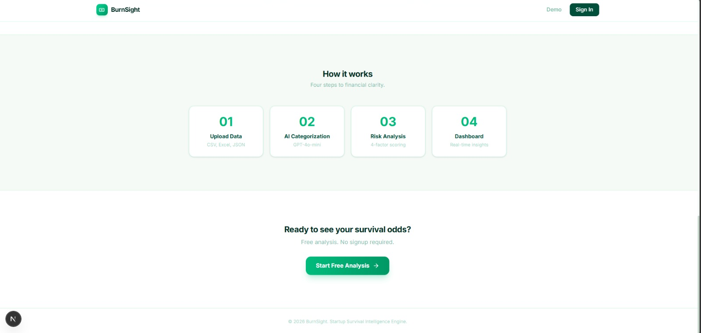
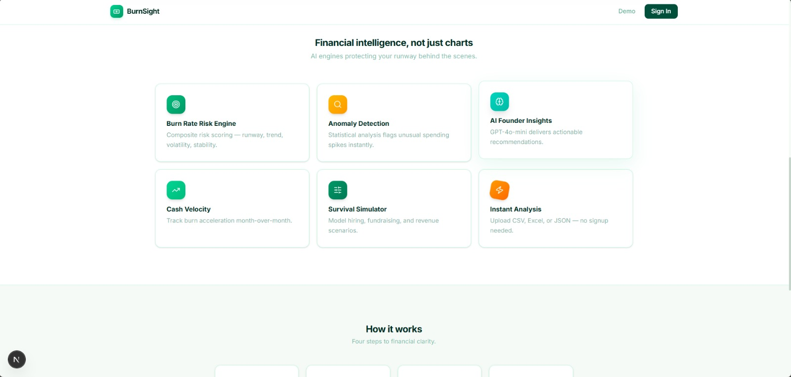
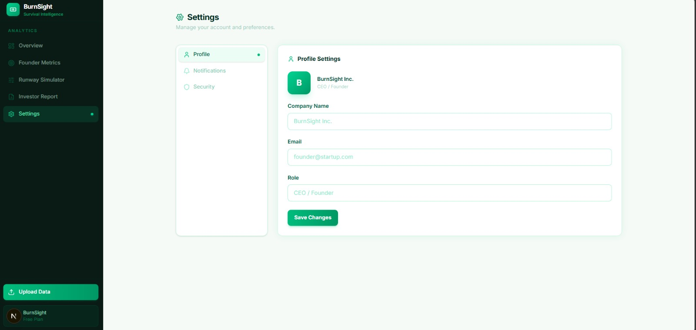

<div align="center">
  

  # 🔥 BurnSight
  **The AI-Powered Financial Analyst & Runway Simulator for Modern Startups**

  [](#)
  [](#)
  [](#)
  [](#)

  <br />

  <p align="center">
    BurnSight is an automated, AI-driven financial dashboard designed exclusively for founders to effortlessly track burn rates, simulate runway scenarios, evaluate growth metrics, and instantly generate investor-ready PDF reports from raw data.
  </p>
</div>

---

## ✨ Features & Walkthrough

We've removed the spreadsheets out of startup finance. Here's a glimpse into the platform:

<br />

### 📊 Comprehensive Finance Overview
Get a bird's eye view of your cash flow, monthly burn, runway, and revenue trends with beautiful, dynamic charts powered by **Recharts**.
<div align="center">
  
</div>

<br />

### 🧠 Advanced Founder Metrics & AI Insights
Dive deep into your operational efficiency. We automatically categorize your expenses, track top-spending categories, and run your data through **Groq AI** to deliver actionable, strategic insights and cost-saving opportunities.
<div align="center">
  
</div>

<br />

### 🚀 Interactive Runway Simulator
Play out the "What-If" scenarios. Will hiring three new engineers shorten your runway to critical levels? Visualize your cash-zero dates based on real, interactive sliders.
<div align="center">
  
</div>

<br />

### 📈 Pristine Investor Reports (Native PDF Generation)
Generate perfect, corporate-style **A4 PDFs** using our native `jsPDF` integration. No clipped borders, no CSS glitches—just perfectly structured reports you can confidently email to VCs directly from your dashboard.
<div align="center">
  
</div>

<br />

---

## 🛠️ How it Works

### 1. Simple Data Ingestion
Simply drop in your transaction CSVs. We parse, categorize, and crunch the numbers completely securely.
<div align="center">
  
  
</div>

### 2. Powerful Capabilities
Whether you're exploring deep UI features or adjusting settings synced securely via **Supabase Auth**, your data and sessions belong securely to you.
<div align="center">
  
  
</div>

---

## 💻 Tech Stack & Architecture

- **Frontend Framework**: Next.js 16 (App Router)
- **Styling**: Tailwind CSS v4, Framer Motion
- **Authentication**: Supabase Auth (SSR)
- **Data Visualization**: Recharts, Lucide Icons
- **AI Processing**: Groq LLM API (Llama 3 / Mixtral)
- **Document Generation**: jsPDF & jsPDF-AutoTable
- **Parsing**: PapaParse

---

## 🚀 Getting Started Locally

1. **Clone the repository:**
   ```bash
   git clone https://github.com/yugdave2005/Hacka-Mined.git
   cd Hacka-Mined
   ```

2. **Install dependencies:**
   ```bash
   npm install
   ```

3. **Set up environment variables:**
   Create a `.env` file mapped to:
   - `NEXT_PUBLIC_SUPABASE_URL`
   - `NEXT_PUBLIC_SUPABASE_ANON_KEY`
   - `GROQ_API_KEY`

4. **Run the development server:**
   ```bash
   npm run dev
   ```

5. **Open** [http://localhost:3000](http://localhost:3000)

---
<div align="center">
  <i>Built with ❤️ for founders who want to focus on building, not bookkeeping.</i>
</div>
